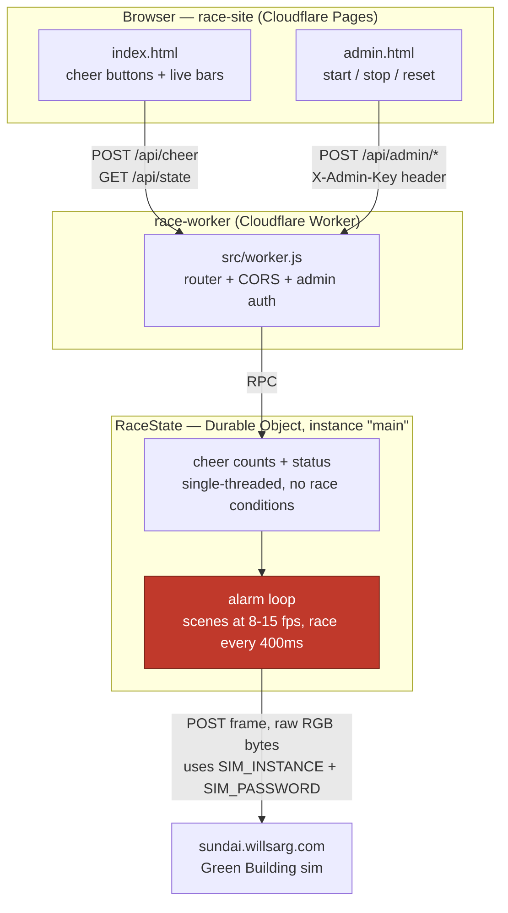

# Green Building Race — Worker

Backend for the mascot race: 4 schools (MIT, Harvard, BU, Northeastern), the crowd cheers
for one via the [race-site](../race-site) frontend, cheers move that school's lane, first
to fill all 9 columns wins. A Durable Object holds the authoritative race state and, on a
timer, renders it to a 17x9 frame and pushes it straight to the Green Building sim — the
sim instance name / event password never reach the browser.

## Why Durable Objects (not R2/KV/D1)

The race needs one strongly-consistent counter set that many concurrent cheer requests
mutate, plus a timer loop that repaints the building. That's exactly what a Durable Object
is for: single-threaded per-instance execution (no race conditions on the cheer counts),
built-in transactional storage, and alarms for the repaint loop — all in one primitive.
R2 is for blobs, KV is eventually consistent (bad for a live counter), D1 would work but is
overkill for one small piece of state. This app uses exactly one DO instance (`"main"`).

## Architecture



`SIM_INSTANCE` and `SIM_PASSWORD` (red node above) exist only as Worker secrets — set via
`wrangler secret put`, read only inside the Durable Object, never returned in any API
response or shipped to the browser.

- `src/worker.js` — HTTP router + CORS + admin auth
- `src/race-state.js` — the `RaceState` Durable Object: cheer counts, start/stop/reset,
  the alarm loop that pushes frames, and `rotateInstance()` to mint a fresh sim instance
- `src/render.js` — race state -> 17x9 pixel frame (lane bars with each mascot riding the head
  of its bar)
- `src/scenes.js` — the reign, intro and countdown scenes, and `frameFor(state, now)`, which picks
  what the building shows for any status
- `src/sprites.js` — mascot pixel art (9x9 kings, 2x3 lane minis), crown, countdown digits
- `src/safety.js` — `FlashGuard` (applied to every frame) and the WCAG flash analyzer used by tests
- `src/mascots.js` — school names/colors
- `scripts/preview-scenes.js` — play the scenes on any sim instance, or export `.bin` clips

## The show

| Status | Default length | On the building |
| --- | --- | --- |
| `idle` | until the host presses Start | **Reign:** the King of the Charles idles with a crown on its head, the river along the bottom floor. The Duck King rules until someone wins; after that, the last winner |
| `intro` | 10 s (3-30) | **Abdication:** the king bows, the crown rises and melts into the gold finish banner, the king sinks into the Charles, the four challengers slide into their lanes |
| `countdown` | 3 s (0-10) | Soft 3, 2, 1 while the challengers wait at the start |
| `running` | until a lane fills | The race; cheers are only accepted now |
| `finished` | until Start / Stop | Winner announcement; the winner becomes the new king |

The last frame of each scene is exactly the first frame of the next (tested), so hand-offs don't
jump. Beat timings scale with the configured intro length.

**Flash safety.** A building-sized display is a large visual field, so every frame goes through
`FlashGuard`: brightness fades rather than cuts, and each window and the facade as a whole are held to
at most 2 flashes per second under the WCAG 2.3.1 definition (the limit is 3). Avoid strobes, full-facade
colour flashes and pure white in new scenes anyway; `npm test` checks the whole pre-race sequence.

**Frame delivery.** Scenes need smoother motion than the race's 400 ms repaint. In `idle`, `intro` and
`countdown` one alarm invocation streams frames for ~2.8 s (15 fps for intro/countdown, 8 fps for the
reign), then re-arms, which stays under the free plan's 50 subrequests per invocation. The reign keeps
streaming while idle, so stop the Worker (or clear `SIM_INSTANCE`) when the building isn't in use.

## Setup

```bash
npm install
```

## Local dev

Copy `.dev.vars.example` to `.dev.vars` and fill in real values (never commit `.dev.vars`):

```
SIM_INSTANCE=<a sim instance name you already have>
SIM_PASSWORD=<the event password>
ADMIN_KEY=<pick any string for local testing>
```

```bash
npx wrangler dev
```

Preview the scenes on your own sim instance (not the shared one) without the Worker:

```bash
node scripts/preview-scenes.js --instance <name>            # every king in turn
node scripts/preview-scenes.js --instance <name> --champion mit --loop
npm test
```

## Deploy

```bash
npx wrangler login        # one-time, opens a browser
npx wrangler secret put SIM_INSTANCE
npx wrangler secret put SIM_PASSWORD
npx wrangler secret put ADMIN_KEY
npx wrangler deploy
```

`wrangler deploy` prints the Worker's URL (`https://green-building-race.<subdomain>.workers.dev`)
— put that in `race-site/config.js` as `API_BASE`, then deploy the Pages site.

## API

| Method | Path | Auth | Body / notes |
| --- | --- | --- | --- |
| GET | `/api/state` | none | race state + per-school progress (0..8), plus `phaseStartedAt`, `phaseEndsAt`, `serverTime` (sync countdowns to this, not the phone clock), `champion` (`null` = Duck King), `config` |
| POST | `/api/cheer` | none, rate-limited per IP+school | `{"school": "mit"\|"harvard"\|"bu"\|"neu"}`; `429` with `reason: "not running"` outside `running` |
| POST | `/api/admin/start` | `X-Admin-Key` header | resets cheers, starts `intro` -> `countdown` -> `running` |
| POST | `/api/admin/stop` | `X-Admin-Key` header | back to `idle` (the reign) from any status; the champion keeps the crown |
| POST | `/api/admin/reset` | `X-Admin-Key` header | full wipe, crown back to the Duck King; timing config is kept |
| POST | `/api/admin/config` | `X-Admin-Key` header | `{"introSeconds": 3-30, "countdownSeconds": 0-10}`, applies from the next Start; `400` if out of range |
| POST | `/api/admin/rotate-instance` | `X-Admin-Key` header | mints a new sim instance with `SIM_PASSWORD`, adopts it |

## Tuning

`src/race-state.js`: `CHEERS_PER_COLUMN` (crowd size vs. race length — lower it for a
smaller crowd), `ALARM_INTERVAL_MS` (how often the building repaints while running),
`SCENE_FPS` / `REIGN_FPS` / `BATCH_MS` (scene smoothness vs. requests per alarm).
